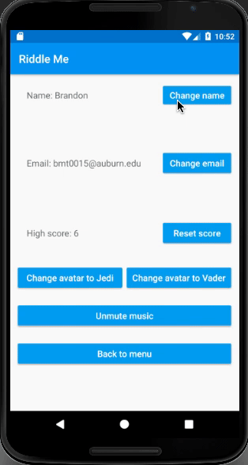
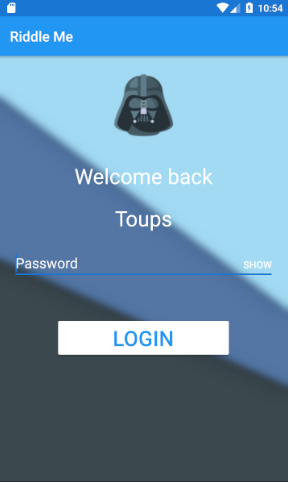

# RiddleMe 

## Description
A simple trivia app built for the purposes of testing your Justin Bieber/Computer 
History knowledge. There is accompanying music from the Star Wars movies depending 
on if you pick Jedi or Vader as your side. 

## Application

|  |  |
|:---:|:---:|
| **The opening splash screen** | **The main login screen** |

---
---

|  |  |
|:---:|:---:|
| **The user enters information** | **The home screen** |

---
---

|  |  |
|:---:|:---:|
| **Correct, Incorrect, and High Score** | **The settings screen**|

---
---

|  |  |
|:---:|:---:|
| **The app remembers upon re-login** | **Name and avatar preferences saved**|

---
---

<video width="320" height="240" controls>
  <source src="sound.mov" type="video/mp4">
</video>

## Technical Aspects
This application has been optimized to run on a Nexus 6 running Nougat API level 25.